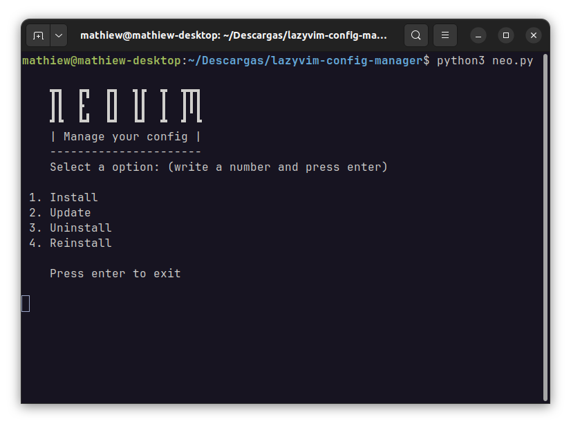

# 🧩 LazyVim Config Manager
This is my neovim config manager written in python. Works with [my LazyVim](https://github.com/Mathiew82/lazyvim-config) derived configuration.
It is basically used to install, update, uninstall, or reinstall the configuration. Feel free to use it 🚀

> [!NOTE]  
> It does not install or uninstall Neovim, it only manages its configuration.

